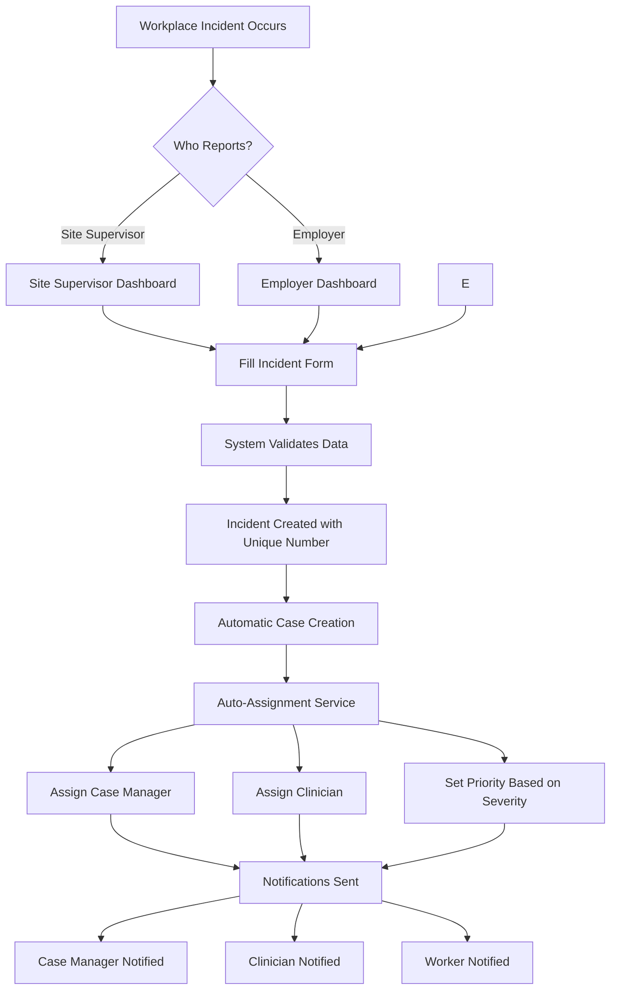
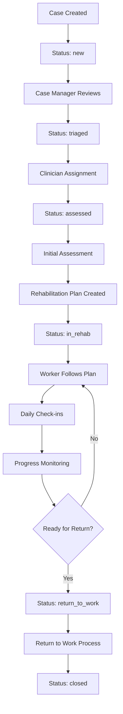
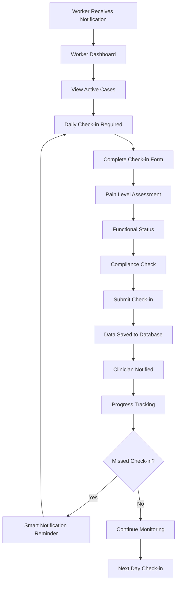
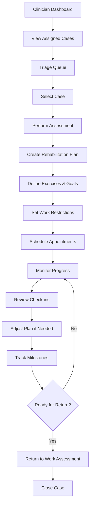
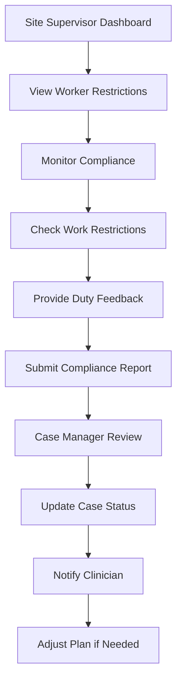
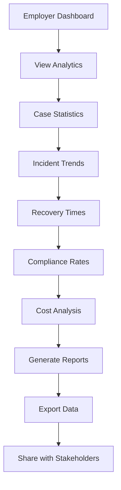

# 🏥 Occupational Rehabilitation Management System - Complete Workflow

## 📋 System Overview

The Occupational Rehabilitation Management System is a comprehensive web-based platform designed to streamline the entire process from workplace incident reporting to full worker recovery and return to work. The system supports multiple user roles with specific workflows and responsibilities.

## 🏗️ System Architecture

### Technology Stack
- **Backend**: Node.js + Express.js + MongoDB + Mongoose
- **Frontend**: React + TypeScript + Material-UI
- **Security**: JWT Authentication + CSRF Protection + Rate Limiting
- **File Storage**: Local uploads + Cloudinary integration
- **Notifications**: Smart notification system with scheduled jobs

### Core Components
1. **Authentication System** - JWT-based with role-based access control
2. **Incident Management** - Report, track, and manage workplace incidents
3. **Case Management** - Complete case lifecycle management
4. **Assessment Tools** - Medical and functional assessments
5. **Rehabilitation Plans** - Customized recovery programs
6. **Appointment Scheduling** - Integrated calendar with telehealth support
7. **Daily Check-ins** - Worker progress monitoring
8. **Smart Notifications** - Automated reminders and alerts
9. **Analytics Dashboard** - Comprehensive reporting and insights

## 👥 User Roles & Responsibilities

| Role | Primary Function | Dashboard Access | Key Responsibilities |
|------|------------------|-------------------|---------------------|
| **Worker** | Daily check-ins, rehabilitation | `/worker` | Complete daily check-ins, follow rehab plans, attend appointments |
| **Employer** | Incident reporting, oversight | `/employer` | Report incidents, monitor cases, view analytics, compliance tracking |
| **Site Supervisor** | Safety compliance, incident prevention | `/site-supervisor` | Report incidents, monitor compliance, provide duty feedback |
| **Case Manager** | Case coordination, scheduling | `/case-manager` | Manage case lifecycle, assign clinicians, coordinate care |
| **Clinician** | Assessments, treatment plans | `/clinician` | Perform assessments, create rehab plans, monitor progress |
| **GP/Insurer** | Medical reports, insurance claims | `/gp-insurer` | Review cases, access medical reports, process claims |
| **Admin** | System management, analytics | `/admin` | User management, system analytics, configuration |

## 🔄 Complete System Workflow

### Phase 1: Incident Reporting & Case Creation



**Key Points:**
- ALL incidents create cases (not just severe ones)
- Automatic case creation ensures proper tracking
- Auto-assignment based on workload and availability
- Priority determined by incident severity:
  - `fatality` → `urgent`
  - `lost_time` → `high`
  - `medical_treatment` → `medium`
  - `first_aid` → `low`
  - `near_miss` → `low`

### Phase 2: Case Management Lifecycle



**Case Status Flow:**
1. **`new`** - Case created from incident
2. **`triaged`** - Case Manager reviews and prioritizes
3. **`assessed`** - Clinician performs initial assessment
4. **`in_rehab`** - Rehabilitation plan created and active
5. **`return_to_work`** - Worker ready to return
6. **`closed`** - Case completed

### Phase 3: Worker Engagement & Check-ins



**Check-in Components:**
- Pain level (1-10 scale)
- Functional status assessment
- Compliance with work restrictions
- Medication adherence
- Exercise completion
- General well-being

### Phase 4: Clinical Management



**Clinical Responsibilities:**
- Initial assessments and evaluations
- Rehabilitation plan creation
- Exercise prescription and monitoring
- Appointment scheduling (including telehealth)
- Progress evaluation and plan adjustments
- Return-to-work readiness assessment

### Phase 5: Compliance Monitoring



**Compliance Monitoring:**
- Work restriction enforcement
- Duty modification compliance
- Safety protocol adherence
- Progress reporting
- Feedback collection

### Phase 6: Analytics & Reporting



## 🔔 Smart Notification System

### Automated Notifications

The system includes a comprehensive smart notification system that runs scheduled jobs:

**Daily Jobs (Asia/Manila timezone):**
- **9:00 AM** - Check-in reminders for missed daily check-ins
- **10:00 AM** - Overdue case alerts (cases not updated in 7 days)
- **11:00 AM** - Rehabilitation milestone checks
- **2:00 PM** - Appointment reminders
- **Every 6 hours** - Critical notification checks

**Notification Types:**
- `incident_reported` - New incident notifications
- `case_assigned` - Case assignment notifications
- `case_created` - New case creation notifications
- `check_in_reminder` - Daily check-in reminders
- `overdue_case` - Overdue case alerts
- `appointment_reminder` - Appointment notifications
- `rehab_milestone` - Rehabilitation milestone alerts

## 📊 Data Flow Summary

### Primary Data Flow
```
Incident → Case → Assessment → Rehabilitation Plan → Check-ins → Return to Work
```

### Key Data Relationships
- **Incidents** create **Cases** (1:1 relationship)
- **Cases** have **Assessments** (1:many relationship)
- **Cases** have **Rehabilitation Plans** (1:1 relationship)
- **Cases** have **Check-ins** (1:many relationship)
- **Cases** have **Appointments** (1:many relationship)
- **Users** have **Notifications** (1:many relationship)

## 🔒 Security & Access Control

### Authentication Flow
1. User logs in with email/password
2. System validates credentials
3. JWT token issued and stored in httpOnly cookie
4. Role-based access control enforced
5. CSRF protection for state-changing operations
6. Rate limiting for API endpoints

### Role-Based Permissions
- **Workers**: Can only access their own cases and check-ins
- **Clinicians**: Can access assigned cases and create plans
- **Case Managers**: Can manage all cases and assign clinicians
- **Employers**: Can view analytics and report incidents
- **Site Supervisors**: Can report incidents and monitor compliance
- **Admins**: Full system access

## 🚀 Key Features & Capabilities

### Auto-Assignment Service
- Intelligent case manager assignment based on workload
- Clinician assignment based on specialty and availability
- Priority assignment based on incident severity
- Automatic notification distribution

### File Management
- Secure image uploads for incidents
- Document storage for cases
- Cloudinary integration for image optimization
- Path traversal protection

### Real-time Updates
- Live notification system
- Real-time dashboard updates
- Progress tracking
- Status change notifications

- Offline capability

## 📈 Performance Optimizations

- Database indexing for faster queries
- Caching with Node-cache
- Gzip compression
- Lazy loading for components
- Image optimization
- Pagination for large datasets

## 🔧 System Configuration

### Environment Variables
```env
NODE_ENV=development
PORT=5000
MONGODB_URI=mongodb://localhost:27017/occupational-rehab
JWT_SECRET=your-super-secret-jwt-key
JWT_EXPIRE=7d
FRONTEND_URL=http://localhost:3000
ENABLE_SCHEDULED_JOBS=true
```

### Default Test Accounts
| Email | Password | Role |
|-------|----------|------|
| admin@example.com | TestPassword123! | Admin |
| casemanager@example.com | TestPassword123! | Case Manager |
| clinician@example.com | TestPassword123! | Clinician |
| employer@example.com | TestPassword123! | Employer |
| worker@example.com | TestPassword123! | Worker |

## 🎯 System Benefits

1. **Comprehensive Tracking** - Every incident is tracked from report to closure
2. **Automated Workflows** - Reduces manual work and ensures consistency
3. **Real-time Monitoring** - Live updates and progress tracking
4. **Compliance Management** - Automated compliance monitoring and reporting
5. **Data Analytics** - Comprehensive reporting and insights
6. **Multi-role Support** - Tailored interfaces for different user types
7. **Mobile Accessibility** - Support for mobile incident reporting
8. **Security** - Robust authentication and authorization system

This system provides a complete solution for occupational rehabilitation management, ensuring proper documentation, tracking, and compliance throughout the entire recovery process.
